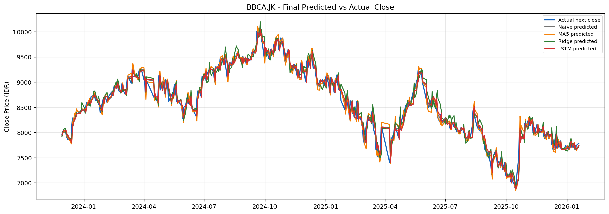
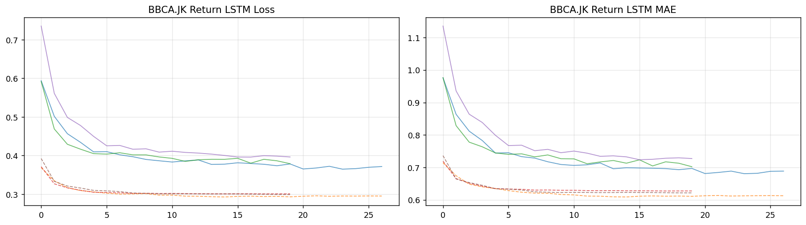
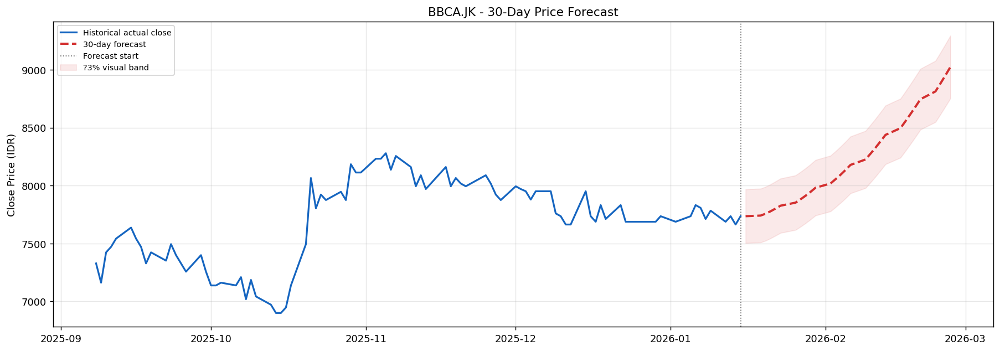
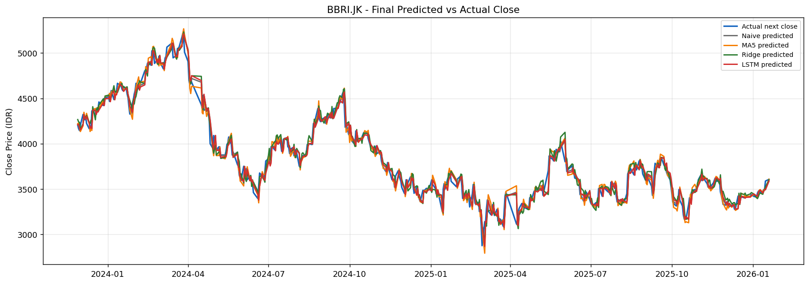
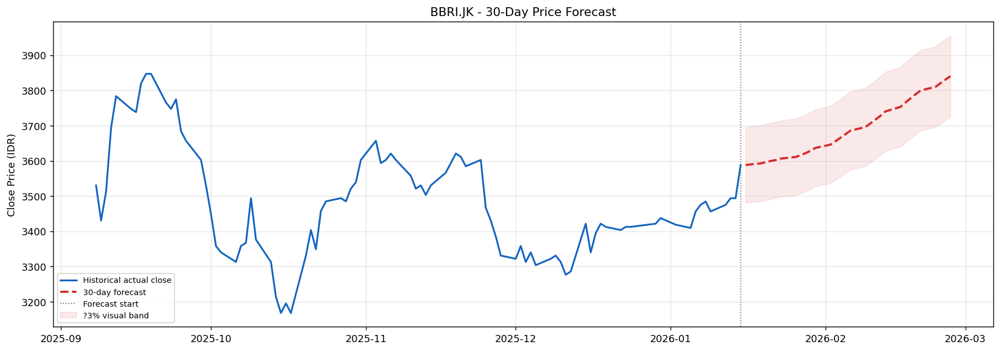
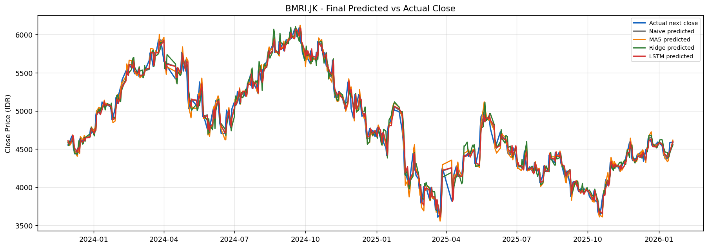
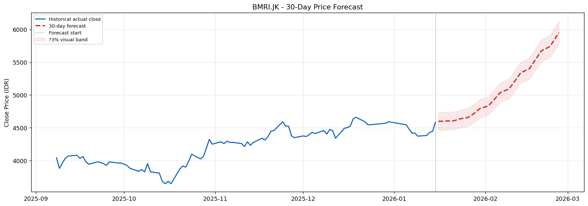

# RaksaDana: Prediksi Harga Saham Bank Indonesia dengan LSTM Return-Based

Pipeline deep learning end-to-end untuk memprediksi log return harian dan merekonstruksi harga saham BBCA.JK, BBRI.JK, dan BMRI.JK menggunakan LSTM dengan walk-forward validation dan perbandingan baseline.

## Tentang Proyek

Model ini memprediksi **Next_Log_Return** (bukan harga Close secara langsung) karena harga saham bersifat non-stasioner. Harga kemudian direkonstruksi via `Close * exp(predicted_return)`. Ketiga saham menggunakan pipeline yang identik untuk konsistensi.

**Saham yang dianalisis**: Bank Central Asia (BBCA.JK), Bank Rakyat Indonesia (BBRI.JK), Bank Mandiri (BMRI.JK)

## Alur Pipeline

```
Pengambilan Data (yfinance)
    → Feature Engineering (15 fitur teknikal)
        → Training LSTM Ensemble (3 seed)
            → Walk-Forward Validation (3 fold)
                → Perbandingan Baseline (Naive, MA5, Ridge)
                    → Forecast 30 Hari
```

## Struktur Proyek

```
RaksaDana/
├── data/
│   ├── raw/                        # Data OHLCV mentah dari yfinance
│   └── processed/                  # CSV fitur + pickle preprocessing
├── models/
│   └── return_model/               # File model .keras terlatih
├── outputs/
│   └── figures/                    # Semua plot hasil notebook
│       ├── BBCA_JK/
│       ├── BBRI_JK/
│       ├── BMRI_JK/
│       └── evaluation/             # Dashboard perbandingan antar ticker
├── reports/
│   └── return_model/               # Laporan evaluasi CSV per ticker
├── notebook/
│   ├── 01.DataCollection&EDA.ipynb
│   ├── 02.preproccesing-and-feature-engineering.ipynb
│   ├── 03.BBCA-Modelling-Evaluation.ipynb
│   ├── 04.BBRI-Modelling-Evaluation.ipynb
│   ├── 05.BMRI-Modelling-Evaluation.ipynb
│   ├── 06.Evaluation-Comparison.ipynb
│   └── 07.RaksaDana-Complete.ipynb  # Notebook gabungan, siap Colab
├── requirements.txt
└── .gitignore
```

## Arsitektur Model

| Layer | Konfigurasi |
|---|---|
| LSTM | 32 unit |
| LayerNormalization | |
| Dropout | 0.20 |
| Dense | 16 unit, ReLU |
| Dense | 1 unit (output) |

**Target**: `Next_Log_Return = log(Close_t+1 / Close_t)`
**Fitur**: 15 fitur berbasis return (OHLCV, RSI, Bollinger Bands, MACD, volatilitas, lagged returns)
**Training**: Ensemble 3 seed [42, 123, 7], prediksi dirata-rata
**Optimizer**: Adam (lr=3e-4), EarlyStopping (patience=12), ReduceLROnPlateau

## Hasil

| Ticker | MAPE | R² | DA |
|---|---|---|---|
| BBCA.JK | 1.18% | 0.9615 | 48.9% |
| BBRI.JK | 1.53% | 0.9747 | 44.7% |
| BMRI.JK | 1.52% | 0.9747 | 47.1% |

MAPE ketiganya di bawah 10% (kategori sangat baik). R² di atas 0.96 menunjukkan rekonstruksi harga yang akurat secara level, meski model dilatih pada return bukan harga absolut.

### BBCA.JK







### BBRI.JK





### BMRI.JK





## Metodologi Evaluasi

- **Walk-forward validation**: TimeSeriesSplit 3 fold, tanpa data leakage
- **Fit status**: Klasifikasi Good Fit / Mild Overfit / Overfit berdasarkan rasio Return_RMSE test/train
- **Acceptance check**: LSTM diterima jika mengalahkan Naive baseline pada Return_RMSE atau Directional Accuracy

## Baseline

| Model | Deskripsi |
|---|---|
| Naive_Zero_Return | Prediksi return = 0 setiap hari |
| MA5_Return | Moving average 5 hari dari log return |
| Ridge_Return | Ridge regression dengan semua 15 fitur |

## Cara Menjalankan

**Lokal**
```bash
pip install -r requirements.txt
jupyter notebook notebook/01.DataCollection&EDA.ipynb
```

**Google Colab**
Buka `notebook/07.RaksaDana-Complete.ipynb`. Notebook mendeteksi Colab secara otomatis dan mount Google Drive. Jalankan semua sel dari atas ke bawah.

## Experiment Tracking

MLflow digunakan untuk mencatat hyperparameter, metrik, dan artefak model. Jalankan `mlflow ui` di root proyek untuk melihat semua run.
