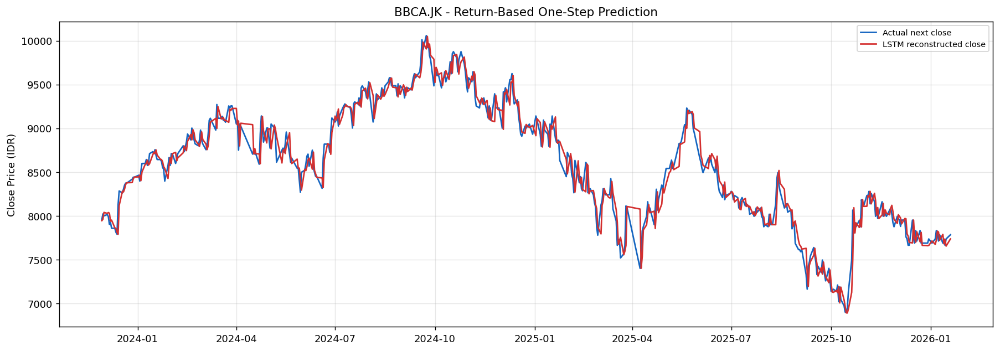
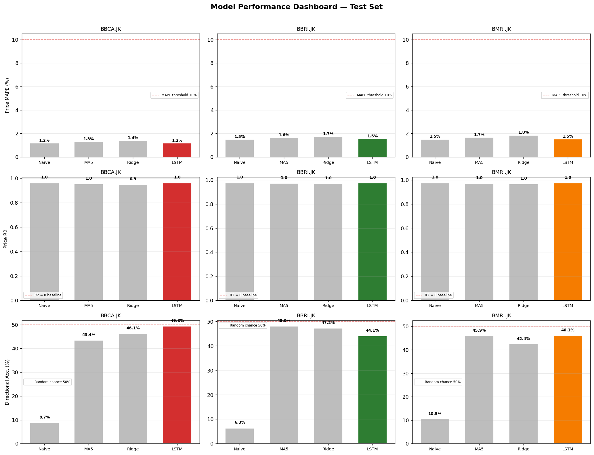

# RaksaDana — Prediksi Harga Saham Perbankan dengan Multivariate LSTM

Dashboard investasi interaktif berbasis LSTM untuk memprediksi pergerakan harga saham BBCA, BBRI, dan BMRI dengan integrasi variabel fundamental (ROE, EPS, Dividend Yield) dan Explainable AI via Google Gemini API.

---

## Tentang Proyek

Investor ritel kesulitan menginterpretasikan data historis dan laporan keuangan secara terpadu. RaksaDana menjawab kebutuhan ini dengan menghadirkan sinyal investasi (Buy/Hold/Sell) berbasis model LSTM multivariate yang transparan dan dapat dijelaskan.

**Research Questions:**
1. Bagaimana pengaruh integrasi variabel fundamental (ROE, EPS, DY) terhadap akurasi LSTM dibanding model univariat?
2. Sejauh mana Google Gemini API efektif mentransformasi output numerik menjadi narasi investasi?
3. Apa faktor fundamental paling signifikan, dan bagaimana kalkulator profit/loss membantu mitigasi risiko?

---

## Alur Pipeline

```
Yahoo Finance (yfinance)
        ↓
  01. EDA & Eksplorasi
        ↓
  02. Preprocessing & Feature Engineering
      (OHLCV + MA + RSI + MACD + BB + ROE/EPS/DY)
        ↓
  03–05. LSTM Modelling per Ticker
         Target: Next_Log_Return → rekonstruksi harga
         Baseline: Naive, MA5, Ridge, LSTM Univariat
        ↓
  06. Cross-Ticker Evaluation
        ↓
  src/inference.py ← FastAPI Backend (Mizan)
        ↓
  Streamlit Dashboard + Gemini Narasi (Chelsa + Mizan)
```

---

## Struktur Proyek

```
RaksaDana/
├── data/
│   ├── raw/                    # CSV harga historis dari yfinance
│   └── processed/              # Featured CSV + preprocessed pickle
├── models/
│   └── return_model/           # .keras models + scalers + feature config
├── notebook/
│   ├── 01.DataCollection&EDA.ipynb
│   ├── 02.preproccesing-and-feature-engineering.ipynb
│   ├── 03.BBCA-Modelling-Evaluation.ipynb
│   ├── 04.BBRI-Modelling-Evaluation.ipynb
│   ├── 05.BMRI-Modelling-Evaluation.ipynb
│   └── 06.Evaluation-Comparison.ipynb
├── outputs/figures/            # Plot PNG per ticker + evaluasi
├── reports/return_model/       # CSV metrics, acceptance, forecast
├── src/
│   └── inference.py            # Fungsi inferensi untuk FastAPI
└── requirements.txt
```

---

## Arsitektur Model

| Komponen | Detail |
|---|---|
| Input | 60 hari × 18 fitur (15 teknikal + ROE, EPS, DY) |
| Target | `Next_Log_Return = log(Close_t+1 / Close_t)` |
| Rekonstruksi harga | `Close_t × exp(predicted_return)` |
| Arsitektur | LSTM(32) → LayerNorm → Dropout(0.2) → Dense(16) → Dense(1) |
| Training | 3 seed ensemble (42, 123, 7), EarlyStopping, ReduceLROnPlateau |
| Validasi | Walk-forward TimeSeriesSplit (3 fold) |

---

## Hasil

| Ticker | MAPE | R² | Direction Accuracy |
|---|---|---|---|
| BBCA.JK | 1.18% | 0.9615 | 48.9% |
| BBRI.JK | 1.53% | 0.9747 | 44.7% |
| BMRI.JK | 1.52% | 0.9747 | 47.1% |

**Prediksi vs Aktual — BBCA**


**30-Day Forecast — BBCA**


**Performance Dashboard (3 Ticker)**


---

## Metodologi Evaluasi

- **Return RMSE:** error prediksi log return (metrik utama)
- **Price MAPE:** error harga rekonstruksi dalam persen
- **R²:** koefisien determinasi harga rekonstruksi
- **Direction Accuracy:** akurasi prediksi arah naik/turun
- **Fit Status:** rasio Test/Train RMSE — Good Fit (<1.25x), Mild Overfit (<1.75x), Overfit (>1.75x)

---

## Baseline

| Model | Deskripsi |
|---|---|
| Naive_Zero_Return | Prediksi return = 0 setiap hari |
| MA5_Return | Rata-rata 5 hari return terakhir |
| Ridge_Return | Ridge regression dengan 18 fitur |
| LSTM_Univariate | LSTM 1 fitur (Close_Log_Return_1) |
| LSTM_Return_Ensemble | Model utama, ensemble 3 seed |

---

## Cara Menjalankan

```bash
# Install dependencies
pip install -r requirements.txt

# Jalankan notebook secara berurutan
jupyter notebook notebook/01.DataCollection&EDA.ipynb
jupyter notebook notebook/02.preproccesing-and-feature-engineering.ipynb
jupyter notebook notebook/03.BBCA-Modelling-Evaluation.ipynb
jupyter notebook notebook/04.BBRI-Modelling-Evaluation.ipynb
jupyter notebook notebook/05.BMRI-Modelling-Evaluation.ipynb
jupyter notebook notebook/06.Evaluation-Comparison.ipynb
```

---

## Inferensi (untuk FastAPI)

```python
from src.inference import predict_next_day, forecast_30d, get_metrics

# Prediksi hari berikutnya
result = predict_next_day("BBCA.JK")
# → {"ticker": "BBCA.JK", "signal": "BUY", "predicted_close": 7820.5, ...}

# Forecast 30 hari
forecast = forecast_30d("BBCA.JK", days=30)

# Metrik model tersimpan
metrics = get_metrics("BBCA.JK")
# → {"mape": 1.18, "r2": 0.9615, "direction_accuracy": 48.9, ...}
```

---

## Deployment

**Platform yang direkomendasikan: HuggingFace Spaces**

Gratis, mendukung Streamlit dan FastAPI (via Docker), dapat menyimpan model file dengan Git LFS.

**Langkah deployment:**

1. Buat akun di [huggingface.co](https://huggingface.co) dan buat Space baru (tipe: Docker atau Streamlit)

2. Install `huggingface_hub`:
   ```bash
   pip install huggingface_hub
   ```

3. Upload model artifacts ke HuggingFace Hub:
   ```python
   from huggingface_hub import HfApi
   api = HfApi()
   api.upload_folder(
       folder_path="models/return_model",
       repo_id="username/raksa-dana-models",
       repo_type="model",
   )
   ```

4. Di `src/inference.py`, tambahkan auto-download model jika tidak ada lokal:
   ```python
   from huggingface_hub import hf_hub_download
   # Download model jika belum ada
   if not model_path.exists():
       hf_hub_download(repo_id="username/raksa-dana-models", filename=model_path.name, local_dir=MODEL_DIR)
   ```

5. Push kode ke Space repository:
   ```bash
   git remote add space https://huggingface.co/spaces/username/raksa-dana
   git push space main
   ```

**Alternatif:** Railway atau Render untuk FastAPI backend saja.

---

## Experiment Tracking

MLflow digunakan untuk tracking hyperparameter dan metrik. Jalankan UI lokal:

```bash
mlflow ui --backend-store-uri sqlite:///mlflow.db
```

---

## Tim

| Nama | Role | Tanggung Jawab |
|---|---|---|
| Chelsa Yoga Permadany | ML Engineer | Feature Engineering, Integrasi Frontend-Backend |
| Fayola Saphira Zulkarnaen | Data Analyst | Data Collection & EDA, Testing |
| Muhammad Akbar Pradana | ML Engineer | Pembangunan Model LSTM, Deployment |
| Bima Mukhlisin Bil Sajjad | ML Engineer | Evaluasi & Tuning, Kalkulator Profit/Loss |
| Moch Mizan Ghodafail | Backend Engineer | FastAPI Backend, Integrasi Gemini API |

**Capstone Project PJK-GM021 — Pijak × IBM SkillsBuild**
